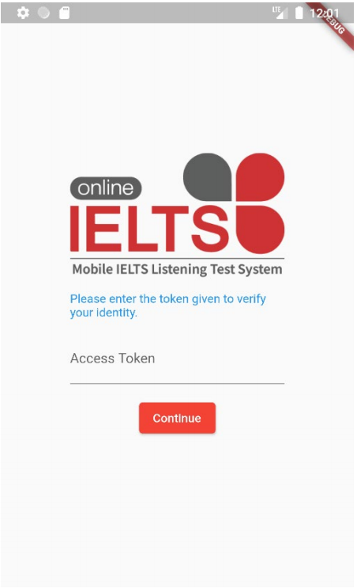
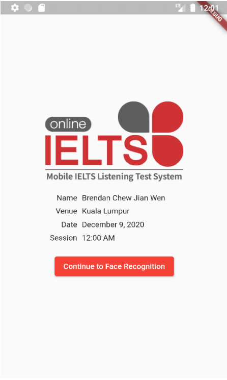
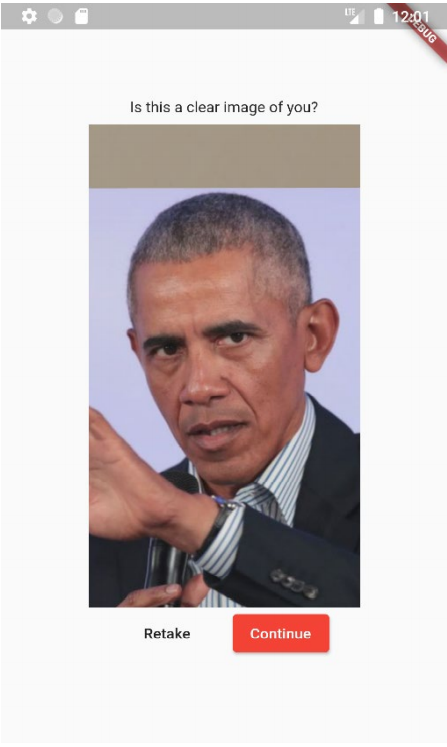
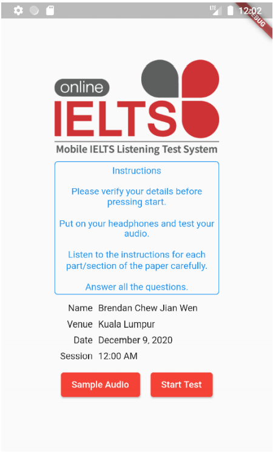
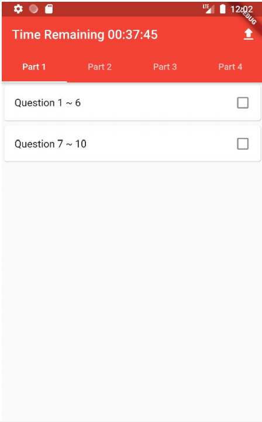
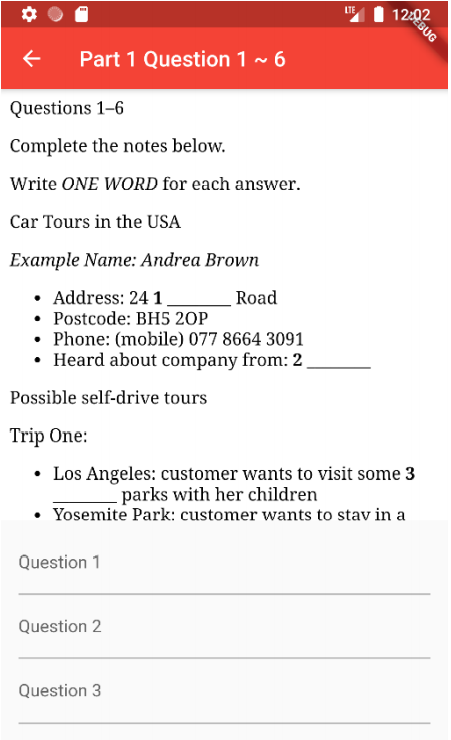
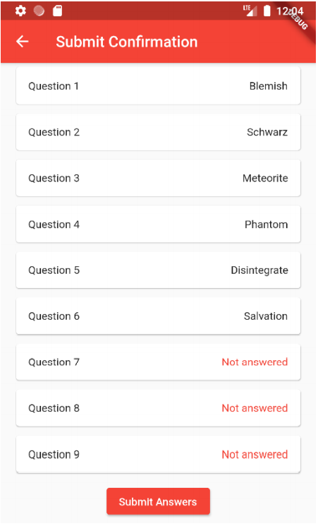
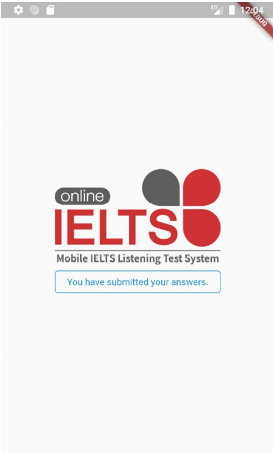

# About this project
## Mobile IELTS Listening Test System

> IELTS, is a system or an international standardization test of English language that tests proficiency for the non-native English speaker. One of
> the assessments of IELTS is the listening test. There exist paper-based tests and computer-based tests, the Mobile IELTS Listening Test
> System is to provide an additional option which is to allow English listening tests to be conducted using a mobile phone. In which could reduce
> the tools required, and further expand IELTS testing centers.

### Get to know more about this project [click here](https://github.com/rockneverendz/BACS3403-Project/blob/master/Mobile%20IELTS%20Listening%20Test%20System%20Poster.pdf).

### This is a **user/client server** of this project, also a **mobile application build in Flutter** for the Mobile IELTS Listening Test System. 
### To know more about the **backend server** of the system [click here](https://github.com/rockneverendz/BACS3403-Project).

# Sample screenshots (Mobile App)

## Insert Token Screen

Simplicity and minimalistic, this is the first page the 
candidate will see once they started the application. 
This screen will require user to insert their valid 
access token to further proceed into the application.

## Test Info
Once validated, the candidate will be bought to the test 
info screen, where they could view the test 
information.
If the candidate is early, they will see a countdown 
timer on the button.
Once the countdown timer reaches 0, the candidate 
will be able to continue to face recognition.

## Face Recognition Verification
The candidate will need to take a clear picture of 
themselves. This screen will allow the candidate to 
double check is the image captured clearly shows the 
candidate’s face.

## Test Preparation
After face verification is completed, the candidate will 
be bought to test start page.
The candidate can test their audio system to see if the 
volume suits their needs.
Then, the candidate can press start test button to begin 
test.

## Questions and recordings
Once this screen is displayed, the recording for Part 
1 will be played followed by Part 2, 3 and 4. 
Candidate will be able to select the question group to 
answer.
Above will be a countdown timer, counting down 
towards the end of the test session.
On the top right corner, we have the submit button, 
candidate will be taken to the candidate’s answer 
sheet once this button is pressed

## Part/Section
Upon entering any one of the question groups, the 
candidate will be presented to the respective question 
group.
Above will be the question group, it is scrollable.
Below will be the answer sheet for the question group.

## Candidate's answer sheet
On the candidate’s answer sheet, the candidate will 
be able to see their entered answers from question 1 
to question 40.
On the bottom we have the submit button. The 
candidate is able to press the submit button to turn in 
their answer sheet.

## End of Test
Once submitted the answers or countdown has ended, 
candidate will be bought to this final page which 
displays “You have submitted your answers” and the 
candidate will be instructed to leave the venue.

# Installation

## How to run

Save `asset/env/.env.example` as `asset/env/.env`  

### Run on Android Emulator
Set `API_URL=10.0.2.2:64165`

### Run on Android device
Set `API_URL=localhost:64165`  
Connect to your andriod device via ADB  
Open Chrome DevTools  
Portforward port `64165` to `localhost:64165`
